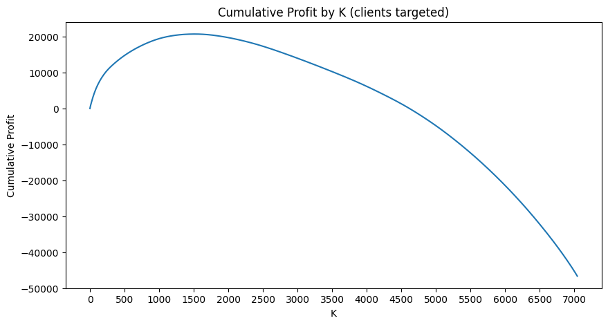
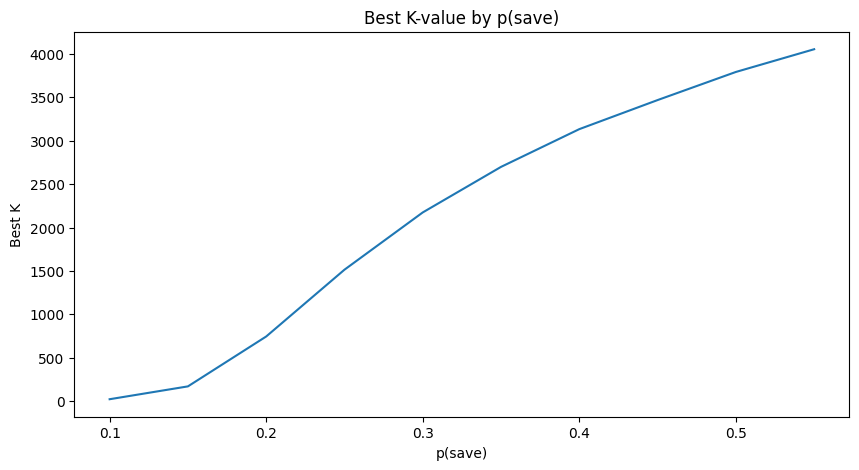

# Telco Churn Prediction with Cost-Based Targeting (XGBoost)

A churn model on the Telco Customer Churn dataset with a simple decision policy: **target customers only when the expected value of a retention offer is positive**.

## Highlights
- **Model**: XGBoost classifier with 5-fold Stratified CV
- **Metric**: Average Precision (AP)
  - Baseline AP: $0.6225$
  - Tuned AP: $0.6728$
  - Validation churn rate: $0.2654$
  - AP lift over prevalence: $2.54×$
- **Retention action**: $15\% \text{discount for 3 months}$
- **Policy**: rank customers by expected profit and target the top-K

## Business framing (decision policy)
Instead of using a fixed probability threshold (e.g., 0.5), I evaluate whether an intervention is worth it economically.

- **Action cost** (per targeted customer):  
  $Cost_action = 0.15 \times MonthlyCharges \times 3$

- **Value lost if the customer churns** (proxy CLV):  
  $Value_lost = MonthlyCharges \times RemainingLifetime$  
  RemainingLifetime is approximated from the contract type (3 / 12 / 24 months).

- **Probability the offer prevents churn**: `p_save` (scenario parameter)

Expected profit per customer:
`ExpectedProfit = P(churn) × p_save × Value_lost − Cost_action`

## Results (plots)
### Cumulative expected profit vs K targeted
This curve shows cumulative Profit by K. Profit peaks at a certain K, then begins decreasing.

### Best K as a function of p(save)
How the optimal number of targeted customers changes under different assumptions about retention action effectiveness.

## Repository contents
- `notebooks/churn_prediction.ipynb` — full workflow (data prep → model → decision policy)
- `assets/` — figures used in this README
- `docs/` — HTML report for GitHub Pages

## Reproducibility
1. Create a virtual environment
2. Install dependencies: `pip install -r requirements.txt`
3. Run the notebook

> the dataset is available on Kaggle [Telco Customer Churn](https://www.kaggle.com/datasets/blastchar/telco-customer-churn/data). I don’t store the full dataset in the repo by default; download it and and adjust the notebook path.

